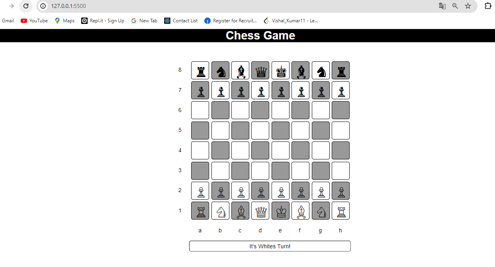

# Chess Game

This is a simple chess game implemented in HTML, CSS, and JavaScript.

## Description

This project aims to provide a basic implementation of a chess game using web technologies. It allows users to play chess in the browser.

## Usage

To use the chess game, simply open the `index.html` file in your web browser. The game board and pieces will be displayed, and you can make moves by clicking on the pieces and dragging them to the desired square.

## Files

- `index.html`: Contains the HTML structure of the chess game.
- `style.css`: Contains the CSS styles for the chess board and pieces.
- `script.js`: Contains the JavaScript logic for the chess game, including move validation and piece movement.
- `README.md`: This file, providing information about the project.

## Dependencies

This project uses jQuery, which is included via CDN (`https://cdnjs.cloudflare.com/ajax/libs/jquery/3.2.1/jquery.min.js`). No additional dependencies are required.

## Contributing

Contributions to the project are welcome. Feel free to open issues for bug reports or feature requests, and submit pull requests with improvements.

## License

This project is licensed under the MIT License. See the [LICENSE](LICENSE) file for details.

## Output Screen

- Chess Game
- 